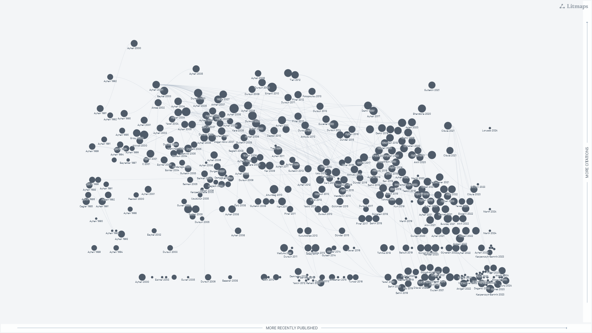
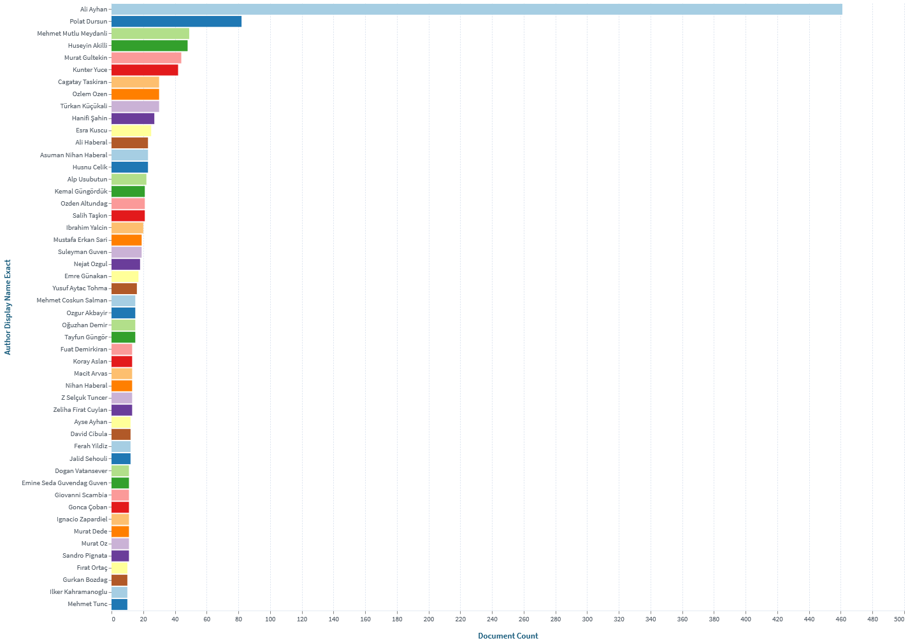

**Prof. Dr. Ali Ayhan**  
*Türk Hekim*  
*Kadın Hastalikları ve Doğum Uzmanı*  
*Jinekolojik Onkoloji Cerrahisi Uzmanı*  

*e-mail:* info\@draliayhan.org 

[International Gynecologic Cancer Society (IGCS): Ali Ayhan'ı anıyoruz](https://igcs.org/remembering-ali-ayhan/)

[Türk Eğitim Vakfı Prof. Dr. Ali Ayhan Burs Fonu](https://bagis.tev.org.tr/burs-fonu-bagisi?q=38683&k=86585)

<video width="640" height="360" controls>
  <source src="./media/TJOD-2024.mp4" type="video/mp4">
  Your browser does not support the video tag.
</video>

<!-- <a href="https://app.litmaps.com/shared/ee0bd4ba-0d19-4553-9263-f27457fb2b54" target="_blank"> -->
<!--      -->
<!-- </a> -->

<!-- <iframe src="https://lens.org/lens/embed/attribution" scrolling="no" height="30px" width="100%"></iframe> -->
<!-- <a href="https://link.lens.org/HBusIUFGNyh" target="_blank"> -->
<!--      -->
<!-- </a> -->

<!-- Anlamli olabilecek Linkler: -->
<!-- Taziye ve Vefat Sonrası -->
<!-- https://igcs.org/awards/ali-ayhan/ -->
<!-- https://x.com/ESGO_society/status/1800191645171826754 -->
<!-- https://trsgo.org/haberler/44 -->
<!-- https://trsgo.org/menu/94/dernek-hakkinda -->
<!-- https://www.tjod.org/aci-kaybimiz-prof-dr-ali-ayhan/ -->
<!-- https://utcd.org.tr/taziye/prof-dr-ali-ayhan/ -->
<!-- https://www.tjod.org/storage/2024/06/TJOD-Haziran-2024_rvz.pdf -->
<!-- https://www.tjodistanbul.org/uploads/haziran24bulten.pdf -->
<!-- https://www.tjodistanbul.org/uploads/300624bp.pdf -->
<!-- https://www.kanalb.com.tr/haberal/prof.-dr.-ali-ayhan,-son-yolculu%C4%9Funa-u%C4%9Furland%C4%B1-1262024113221 -->
<!-- https://www.msn.com/tr-tr/haber/other/hayat%C4%B1n%C4%B1-kaybeden-prof-dr-ali-ayhan-memleketi-anamur-da-topra%C4%9Fa-verildi/ar-BB1o6RaO -->
<!-- https://haberglobal.com.tr/kultur-sanat/kadin-hastaliklarinin-duayen-hocasi-prof-dr-ali-ayhan-84-yasinda-hayatini-kaybetti-351552 -->
<!-- https://www.turkiyegazetesi.com.tr/gundem/prof-dr-ali-ayhan-hayatini-kaybetti-1045910 -->

<!-- Makale ve Internet bilgilendirmeleri -->
<!-- https://ijgc.bmj.com/content/30/7/1077 -->
<!-- https://www.medikalakademi.com.tr/prof-dr-ali-ayhan-asi-ve-tarama-programlari-rahim-agzi-kanseri-goruelme-oranini-azaltti/#google_vignette -->

<!-- Hastalardan -->
<!-- https://x.com/unalemincanbay/status/1238758647615967233 -->

<!-- Anlamli olabilecek Linkler: -->
<!-- https://igcs.org/awards/ali-ayhan/ -->

<!-- Taziye ve Vefat Sonrası -->

<!-- https://x.com/ESGO_society/status/1800191645171826754 -->

<!-- https://trsgo.org/haberler/44 -->

<!-- https://www.tjod.org/aci-kaybimiz-prof-dr-ali-ayhan/ -->

<!-- https://utcd.org.tr/taziye/prof-dr-ali-ayhan/ -->

<!-- https://www.tjod.org/storage/2024/06/TJOD-Haziran-2024_rvz.pdf -->

<!-- https://www.tjodistanbul.org/uploads/haziran24bulten.pdf -->

<!-- https://www.tjodistanbul.org/uploads/300624bp.pdf -->

<!-- https://www.kanalb.com.tr/haberal/prof.-dr.-ali-ayhan,-son-yolculu%C4%9Funa-u%C4%9Furland%C4%B1-1262024113221 -->

<!-- https://www.msn.com/tr-tr/haber/other/hayat%C4%B1n%C4%B1-kaybeden-prof-dr-ali-ayhan-memleketi-anamur-da-topra%C4%9Fa-verildi/ar-BB1o6RaO -->

<!-- https://haberglobal.com.tr/kultur-sanat… -->

<!-- Kanal B Ozel Kose -->

<!-- https://www.youtube.com/watch?v=0fQxg3ngVu8 -->

<!-- https://www.youtube.com/watch?v=RP6g3QQOtBs&t=6s -->

<!-- https://www.youtube.com/watch?v=ZWVF4AbneUU&t=10s -->

<!-- TRSGO Kurucu Baskan -->
<!-- https://trsgo.org/menu/94/dernek-hakkinda -->

<!-- MEU Kampus Acilisi -->
<!-- https://www.youtube.com/watch?v=XdGaFJUlgxM&t=28s -->

<!-- Medya Bilgilendirme (TV - Gazete - Yerel) -->
<!-- https://www.youtube.com/watch?v=j9Cb9YhVM40&t=323s -->

<!-- https://www.youtube.com/watch?v=OTD7fj2V3L8 -->

<!-- https://www.youtube.com/watch?v=DQkRzK6z1Oo -->

